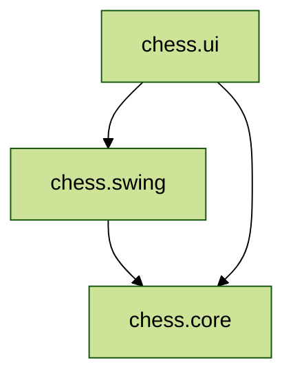

!!!warning Entwurf 
Diese Konzepte sind noch nicht final und können sich ändern
!!!

## Hautptmodule

!!!info Mehrdeutigkeit 
Unter Module versteht man hier [IntelliJ Module](https://www.jetbrains.com/help/idea/creating-and-managing-modules.html)
, nicht
[Java 9 Module :link:](https://en.wikipedia.org/wiki/Java_Platform_Module_System)
!!!

Das Projekt besteht aus 3 Modulen:

| Name        | Funktion                                |
|-------------|-----------------------------------------|
| chess.core  | Logik des Schachspiels                  |
| chess.swing | Swing Komponenten und Klassen zu Schach |
| chess.ui    | Spielanwendung in Swing geschrieben     |

Die Module haben folgende Abhängigkeiten:

Wie man sieht, hat das Logik-Modul **keine** Referenz auf die UI-Module (gegenseitige Referenzen währen auch nicht
möglich), denn sie wird strikt von der UI getrennt. Es soll dadurch auch von einer GUI-losen Serveranwendung
konsumierbar sein.

Als Buildsystem wird IntelliJ IDEA verwendet

[!ref Artikel über Buildsysteme](https://blog.jetbrains.com/upsource/2015/09/09/mysterious-build-system-setting/)

