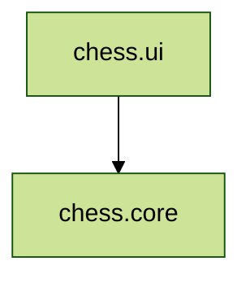

_Schach Regel_

## REGELN

Schach wird nach folgenden Regeln gespielt

| Name        | Funktion                                |
|-------------|-----------------------------------------|
| chess.core  | Logik des Schachspiels                  |
| chess.ui    | Spielanwendung in Swing geschrieben     |

Die Module haben folgende Abhängigkeiten:

Wie man sieht, hat das Logik-Modul  Referenz auf die UI-Module (gegenseitige Referenzen währen auch nicht
möglich), denn sie wird strikt von der UI getrennt. Es soll dadurch auch von einer GUI-losen Serveranwendung
konsumierbar sein.

Als Buildsystem wird IntelliJ IDEA verwendet

