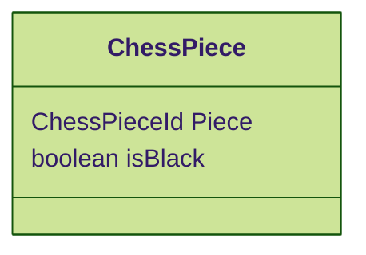

## Klassendiagramm
!!!warning 🚧 Baustelle 🚧 
In Arbeit
!!!

```mermaid
%%{init: { 'theme': 'forest' } }%%
classDiagram
    class ChessPiece {
        ChessPieceId Piece
        boolean isBlack
        
    }
    ChessPiece
```