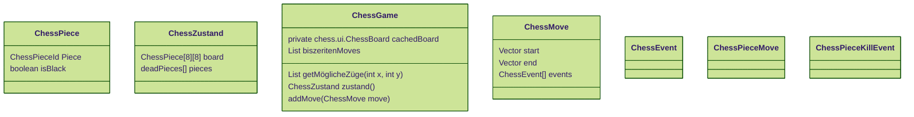

## Klassendiagramm

!!!warning 🚧 Baustelle 🚧 
In Arbeit
!!!

chess.core:

```mermaid
%%{init: { 'theme': 'forest' } }%%
classDiagram
    class ChessPiece {
        ChessPieceId Piece
        boolean isBlack
        
    }

    class ChessZustand {
        
        ChessPiece[8][8] board
        deadPieces[] pieces
    }

    class ChessGame {
        List getMöglicheZüge(int x, int y) 

        ChessZustand zustand()

        addMove(ChessMove move)

        
        
        private chess.ui.ChessBoard cachedBoard

        List biszeritenMoves
    }

    class ChessMove {
        Vector start
        Vector end

        
        
        ChessEvent[] events
    }

    class ChessEvent {

    }

    class ChessPieceMove {

    }

    class ChessPieceKillEvent {

    }

    
```