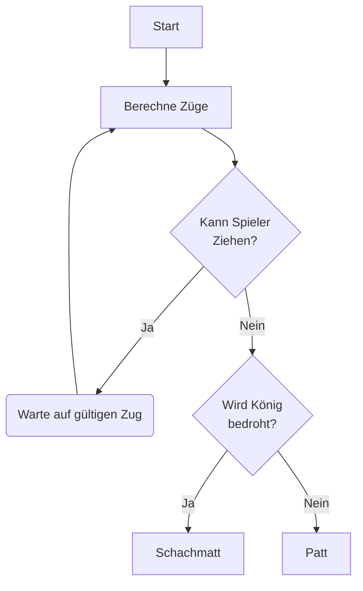

Der Ablauf des Schachspiels lässt sich so darstellen:

```mermaid
flowchart TB
    Start --> Z
    Z[Berechne Züge]
    Z --> K{Kann Spieler\nZiehen?}
    K -->|Ja| Warte(Warte auf gültigen Zug)
    K -->|Nein| S{Wird König\nbedroht?}
    S -->|Ja| SM[Schachmatt]
    S -->|Nein| P[Patt]
    Warte --> Z
```

