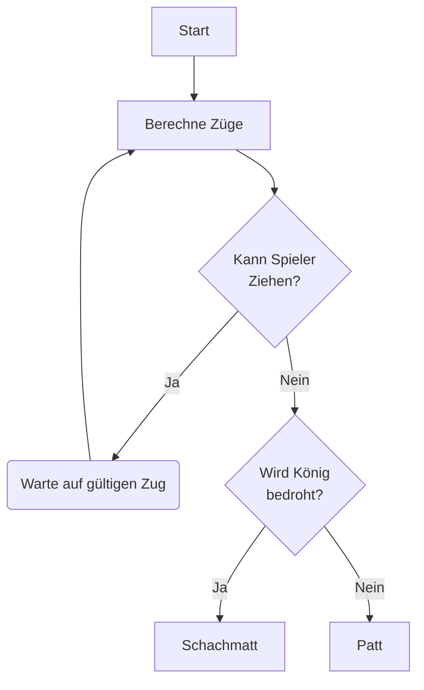
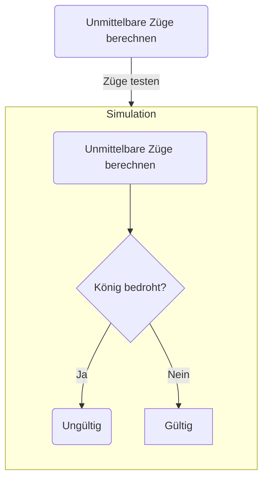

Der Ablauf des Schachspiels lässt sich so darstellen:

## Zugberechnung

Bei der Zugberechnung gibt es beim Schach unterschiedliche Ebenen der Berechnung

=== 1. Unmittelbare Züge 
Zunächst werden alle unmittelbare Züge der Figuren anhand der allgemeinen Zugmuster berechnet. 
Hierbei wird folgendes beachtet:

* Felder die von eigenen Figuren besetzt werden
* Felder die hinter einer gegnerischen Figur stehen und somit den Zug der Figur blockieren
* Sonderregeln wie En Passant, Rochade...

=== 2. Vom Gegner gefährdete Figuren 
Beim Schach sind Züge ungültig, die zur Bedrohung des eigenen Königs führen. 
Somit ist ein Zug ungültig, wenn er zu einem Zustand führt, der diese Eigenschaften erfüllt: 

* Der Gegner ist am Zug
* Der Gegner bedroht den König des Spielers
    * Hierbei müssen lediglich die unmittelbaren Züge (Ebene 1) des Gegners geprüft werden

===

