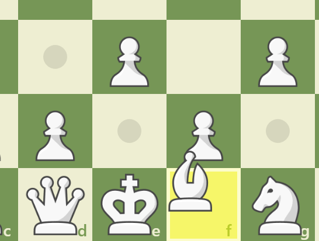
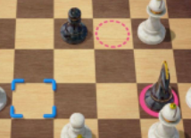

---  
order: 505  
author: David B.
---

## UI

Arbeit an mehreren Board-Anzeigekomponenten

* Board-Anzeigekomponenten werden mit der Board-größe skalierbar sein, also keine feste Größe oder Position haben.

Referenzen:

## Core

* Rückgängig- und Wiederholungsfunktionen
* Performance Optimierungen

## IDE-Config

## Ausblick:

* Die Fertigstellung eines ersten spielbaren Prototyps rückt immer näher!
* Es wird visuelle Anzeigen (siehe oben) zu Gefahrenfeldern, bewegbaren Figuren und möglichen Zügen angezeigt werden
* Wegen der Komplexität von Java-Buildsystemen (Gradle, Maven) und deren hohem Zeitaufwand, wird es keinen Multiplayer
  geben, da Spring die verwendung eines solchen Buildsystems benötigt
* Womöglich wird es Dame-Spiel geben
    * Der einzige programmatische Unterschied zwischen Schach und Dame ist der Zugzwang und das ein Spieler bei einem
      Wurf nochmal ziehen darf
* KI hat niedrigere Priorität