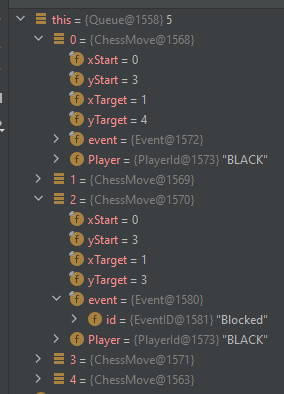

Protokoll der Arbeit seit dem letzten Protokoll

## UI

* Visuelle Indikatoren für ziehbare Figuren
* Nicht ziehbare Figuren können nun nicht mehr gegriffen (dragged) werden
* Undo-Button eingefügt
* Code Qualität der visuellen Indikatoren (`CornerBorder`) wurde verbessert
    * Erlaubt einfache änderung der Farbe, Länge, Dicke

## Logik

* Rückgängig-funktion
* Schräges Schlagen der Bauern implementiert
* Zuglogik des Pferdes fertig

**Die Basis-Zugmuster der Figuren sind nun implementiert. Es fehlen lediglich Extraregeln, wie En Passant und Rochade,
sowie Königsschutz**

## Entwicklung

Es wurde eine Debug-Ansicht für `Queue` erstellt.

Mit _Custom Type Renderers_ kann man in IntelliJ die Anzeige eines Objekts im Debugger anpassen.

[!ref Custom Type Renderers](https://www.jetbrains.com/help/idea/customizing-views.html#renderers)

Dadurch kann man unter anderem die Darstellung einer rekursiven Datenstruktur, wie einer verketteten Liste, verbessern,
indem man einen Typ-Renderer erstellt, der die Inhalte abgeflacht darstellt.

Man kann Typ-Renderer über eine GUI und durch Annotationen erstellen. Typ-Renderer die über die GUI erstellt wurden
können allerdings nicht einfach mit dem Team geteilt werden, deshalb habe ich mich dazu entschieden den Typ-Renderer
durch Annotationen zu erstellen. Diese unterstützen zwar nicht so einen großen Funktionsumfang wie die GUI-Renderer, für
unsere `Queue` reichen sie aber aus.

Nachdem man
das [Jetbrains-Annotations-Package hinzugefügt](https://www.jetbrains.com/help/idea/annotating-source-code.html) hat,
kann man sie so konfigurieren:

```java

@Debug.Renderer(text = "this.getNumberOfElements()",
        childrenArray = "this.toArray()")
public class Queue
{
    //...
}
```

Die Elemente der Queue und deren Länge lassen sich dann viel besser inspizieren:

  
  
